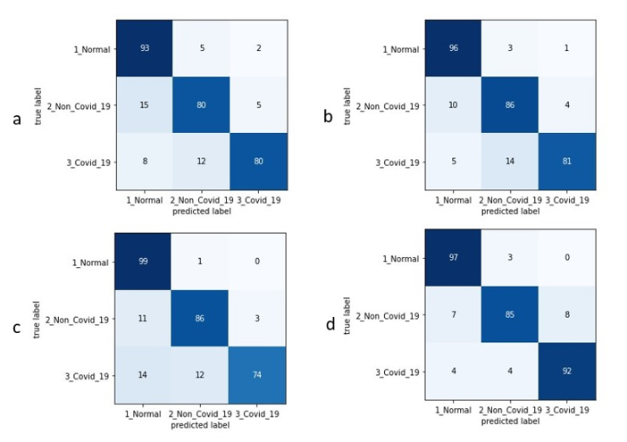

# COVID-19-X_ray-image-classification

To create the dataset - please go to the following link - https://github.com/lindawangg/COVID-Net

Generating the dataset - https://github.com/lindawangg/COVID-Net/blob/master/docs/COVIDx.md

Please use the text files available in https://github.com/as4401s/COVID-19-X_ray-image-classification/tree/master/Creating_the_dataset

The text file was then converted to csv and renamed according to the class names.

A few sample images from each class of the train and test set is available at the following link - https://github.com/as4401s/COVID-19-X_ray-image-classification/tree/master/Dataset

## Results:

#### Confusion matrix on the 300 test images for the open-source architectures a: VGG19 [14], b: Resnet50 V2 [15], c: Densenet121 [16], d: Inception V3 [33]. Inception V3 has the best results, with the least number of false predictions. ResNet50 V2 has the next best result, followed by DenseNet121 and VGG19, respectively.
